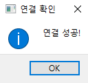

**coin_project**
 
2021-01 오픈소스프로젝트_과제 안녕하세요팀
  
### 프로젝트명 (주제)

| (국문) 가상화폐 자동매매 시스템(개인용)                     |
|-------------------------------------------------------------|
| (영문) A Virtual Current Automatic Trading System(Personal) |

### 팀장

| GitHub저장소 | <https://github.com/True-Kim/coin_project> |
|--------------|--------------------------------------------|
| Youtube URL  | <https://youtu.be/feG2iuN3Qbg>             |
| 학부(과)     | 빅데이터협동과정                           |
| 학년/학번    | (2)학년 / 2020278010                       |
| 성 명        | 김 진 실                                   |

### 개발기간

| 2021년 3월 5일 \~ 2021년 6월 18일 |
|-----------------------------------|

### 참여학생

| 학부(과)         | 학년/학번            | 성 명    |
|------------------|----------------------|----------|
| 빅데이터협동과정 | (2)학년 / 2020278007 | 전 유 정 |
| 소프트웨어학과   | (3)학년 / 2019038103 | 이 재 승 |
| 소프트웨어학과   | (2)학년 / 2020039032 | 조 정 호 |

### 강좌/ 교수

| 강좌명 | 오픈소스전문프로젝트 | 성 명 | 강 재 구 |
|--------|----------------------|-------|----------|

### 프로젝트 주제 요약

**-정의**

이더리움 코인의 목표가를 자동으로 계산하여 24시간 모니터링 하며 해당 코인의
현재가가 목표가에 도달하면 자동으로 시장가 매수하고, 현재가가 목표하는 일정
수익에 도달하면 자동으로 시장가 매도하는 개인용 코인 자동매매 시스템

**- 개발목적**

개인의 판단으로 매수, 매도를 결정하는 것보다 자동매매 시스템의 도움으로 매수
매도를 하는 것이 더 안정적으로 수익을 낼 수 있을 것으로 예상되기 때문에 매매에
어려움을 겪는 초보자를 돕고자 함

**- 주요기능(요구사항)**

1. 프로그램 로그인 창(Upbit API로 로그인하기)

2. 프로그램 메인 창

2-1) 매매 시작 및 종료 버튼 생성 & 자동매매 거래내역 표시

3-2) 이더리움 코인의 실시간 개요 정보 표시

2-3) 실시간 사용자 자산 조회(변화 표시)

2-4) 이더리움 코인의 실시간 호가창 표시

2-5) 이더리움 코인의 현재가 실시간 추이 정보 표시

### 개발선행기술 조사분석

| 특허 | - 1020190057188 (2019.05.15.) 최종훈. 종목정보를 이용하여 자동매매 기법을 수행하는 주식거래 시스템(A STOCK TRADING SYSTEM THAT PERFORMS AUTOMATIC TRADING TECHNIQUES USING STOCK INFORMATION)|
|----------|----------------------------------------------------------------------------------------------------------------------------------------------------------------------------------------------------------------------------------------------------------------------------|
| 논문 | - 이재원, 김성동, 이종우, 채진석. (2002). R-Trader: 강화 학습에 기반한 자동주식거래시스템. 정보과학회논문지: 소프트웨어 및 응용, 29(11·12), 785-794.   -김경목, 김선웅, 최흥식. (2021). 투자자별 거래정보와 머신러닝을 활용한 투자전략의 성과. 지능정보연구, 27(1), 65-82.  |
| 상용제품 | - 주식자동매매 오토트레이더 : https://자동매매.kr                                                                                                                                                                                                                          |

### 프로젝트 개발 환경

| H/W              | 컴퓨터                                                                                                                                                                                                                                                |
|------------------|-------------------------------------------------------------------------------------------------------------------------------------------------------------------------------------------------------------------------------------------------------|
| S/W              | Python, PyQt5                                                                                                                                                                                                                                         |
| OPEN Source 활용 | - 1) UPbit API : 개인 자산 주문 API, 코인 가격 정보 등 제 - 2) Pyupbit module : Upbit API를 더 손쉽게 가져올 수 있는 오픈소스 모듈 - 3) wikidocs : 베이직 코드 및 타 거래소(빗썸)의 자동매매프로그램 코드 제공 - 4) GitHub : 팀원간 협업 및 소스 관리 |

### 팀 업무분장

| 이름   | 책임 | 역할                                         | 비고 |
|--------|------|----------------------------------------------|------|
| 김진실 | 팀장 | 프로젝트 총괄 및 구현, Git hub 관리          |      |
| 전유정 | 팀원 | 프로젝트 데이터 연동 및 GUI 구현 및 일정관리 |      |
| 이재승 | 팀원 | 프로젝트 자료조사, 녹화 및 발표, 테스트      |      |
| 조정호 | 팀원 | 프로젝트 GUI 구성, 자료조사, 발표, 테스트    |      |

### 개발결과물

**1. 시스템구성도**

\*주의 : 현재 이 프로그램은 이더리움 코인만 거래 할 수 있습니다. 추후 사용자가
원하는 코인 거래로 변경 할 수 있는 옵션을 추가할 계획입니다.

**2. 실행화면**

**1) Login window**

**1-1) 로그인 창**

\- Upbit 개인 API Key로 로그인(신청한 IP에서만 사용 가능)

\- Upbit API가 없는 경우 클릭하면 Upbit API 웹사이트로 연결

**1-2) 로그인 성공 여부 메시지**

\- Upbit API 연결 성공시 list 반환 -\> 연결 성공 메시지 출력

\- Upbit API 연결 실패시 dict 반환 -\> 연결 실패 메시지 출력

**2) Main window**

**2-1) 매매 시작, 매매 종료 버튼 제공**

\- 매매시작 클릭시 오늘의 목표가를 자동으로 계산

\- 자동 계산된 목표가와 현재가가 같아지면 시장가로 코인을 매수

\- 매매종료시 프로그램 종료

\- 매매시작 클릭시 자동매매 거래내역 창에 메시지 시작/종료 메시지 출력

\- 매수, 매도 거래 성공시 시간 및 거래내역 출력

**2-2) 실시간 개요창 Widget**

\- 이더리움 코인에 대한 실시간 개요창을 보여줌

\- 현재가, 전 날 대비 상승/하락율 표시

\- 24시간 거래량, 거래금액, 체결 강도 및 고가, 저가, 전일 종가를 테이블 형식으로
표시

**2-3) 실시간 자산내역**

\- 보유 코인에 대한 실시간 자산 내역 변화를 한눈에 제시

\- 테이블 첫 번째 줄은 원화 자산을 표시

\- 가격 표시가 되지 않는 코인은 상장 폐지되어 정보가 없는 코인

**2-4) 실시간 호가정보 Widget**

\- 실시간으로 변화하는 이더리움 호가 정보 표시

\- 푸른색 Progress bar 테이블은 매도 호가 정보의 진행상황 표시

\- 붉은색 Progress bar 테이블은 매수 호가 정보의 진행상황 표시

**2-5) 실시간 현재가 추이 Widget**

\- 1초 단위로 이더리움 현재가의 추이 표시

**3) 프로그램 종료시 자동거래 및 모든 Background 파일 종료**

활용 오픈소스

1.  파이썬을 이용한 비트코인 자동매매 wikidocs

\- <https://wikidocs.net/21811>

1.  pyupbit 패키지

\- <https://github.com/sharebook-kr/pyupbit>

1.  Upbit API 참조 문서

\- <https://docs.upbit.com/reference>

1.  Git 초보를 위한 Pull Request 방법

\- 4-1.
<https://wayhome25.github.io/git/2017/07/08/git-first-pull-request-story/>

\- 4-2. <https://dev-youngjun.tistory.com/47>

1.  PyQt5 slot-signal 사용법

\- <https://www.youtube.com/watch?v=O9wUwI9HcdE>

1.  PyQt5 Thread 사용법(동시에 다른 일을 할 수 있도록 스레드 생성)

\- <https://youtu.be/3ogKXcmZncc>

기대효과 및 발전방향

**1. 기대효과**

1.  개인의 판단으로 매수, 매도를 결정하는 것보다 자동매매 시스템의 도움으로
    전략적인 매수, 매도를 하여 안정적 수익이 기대할 수 있다.

2.  24시간 장인 코인 시장에서 24시간 직접 모니터링 하는 것이 아니라 시스템이
    모니터링 하여 노동력 분산을 기대할 수 있다.

3.  현재 시스템에서는 상승장에서만 구매가 가능하도록 하였으므로, 하락장에서는
    구매가 이루어지지 않아 개인적인 손실을 최소화한다.

**2. 발전 방향**

1.  현재 한 가지 코인에 대한 거래만 지원하지만, 업비트에서 거래를 제공하고,
    사용자가 원하는 다른 코인으로 변경할 수 있도록 선택지를 제공한다.

2.  현재는 코인의 상승장에서만 구매가 가능하도록 하였지만, 하락장에서 단기간에
    안정적으로 수익을 낼 수 있는 구매 전략을 연구하고 추가한다.

3.  머신러닝, 딥러닝 알고리즘을 이용하여 미래 가격을 예측하는 서비스도 추가할 수
    있다.

Key Words (5개) : 이더리움, 가상화폐, 자동 거래, API, 시스템 트레이딩

**\<첨부 1\> git hub To do list**

**\<첨부 2\> 초기 GUI 설계도**

